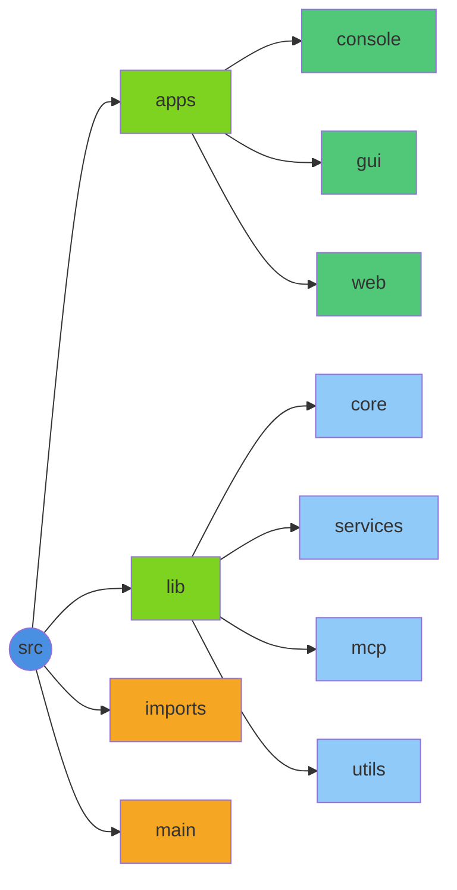

# Knik Documentation

AI-powered voice console with async TTS processing.

## Quick Start

```bash
npm run start:console
```

## Documentation Index

### 📚 Getting Started Guides

- [GUI Application Guide](guides/gui.md) - 🖥️ Desktop GUI application guide
- [Console Application Guide](guides/console.md) - Interactive AI chat with voice
- [Web Application Guide](guides/web-app.md) - Modern React + FastAPI web app
- [Electron Desktop Guide](guides/electron.md) - Electron desktop app packaging
- [MCP Tools Guide](guides/mcp.md) - Model Context Protocol tools
- [Frontend Polish Guide](guides/frontend-polish.md) - UI/UX implementation details

### 🚀 Development

- [Setup](development/setup.md) - Installation and configuration
- [Roadmap](development/roadmap.md) - Development plan & future features
- [Linting](development/linting.md) - Code quality & formatting
- [Deployment](development/deployment.md) - Deployment guide
- [Streaming Architecture](development/streaming.md) - Streaming system details

### 📖 Technical Reference

- [API Reference](reference/api.md) - Code documentation
- [Environment Variables](reference/environment-variables.md) - Configuration options
- [Conversation History](reference/conversation-history.md) - AI memory & context system
- [Path Aliases](reference/path-aliases.md) - Import path configuration
- [MCP LangChain Pattern](reference/mcp-langchain-pattern.md) - MCP tool binding pattern

### 🧩 Components

- [Web App Architecture](components/web-architecture.md) - React + FastAPI architecture
- [React Frontend](components/react-frontend.md) - React + Vite + TypeScript setup
- [React Common Components](components/react-common-components.md) - Reusable UI components
- [Electron Assets](components/electron-assets.md) - Desktop app icons & resources

### 🎮 Demos

- [Demo Scripts](demos/README.md) - Demo scripts by functionality

## Quick Links

**User Documentation:**
- [Quick Start Guide](guides/gui.md)
- [Setup Instructions](development/setup.md)
- [Web App Guide](guides/web-app.md)

**Developer Documentation:**
- [API Reference](reference/api.md)
- [Development Roadmap](development/roadmap.md)
- [Code Quality](development/linting.md)

**Technical Reference:**
- [MCP Tools](guides/mcp.md)
- [Environment Variables](reference/environment-variables.md)
- [Conversation History](reference/conversation-history.md)

## Project Structure



## Documentation Categories

### Guides
Step-by-step instructions for using Knik applications and features.

### Development
Information about setting up, developing, and maintaining Knik.

### Reference
Technical documentation and API references for developers.

### Components
Detailed documentation about specific components and their architecture.

### Demos
Examples and test scripts demonstrating Knik functionality.
