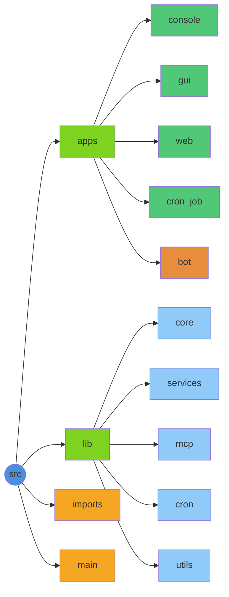

# Knik Documentation

Multi-interface AI assistant with async TTS processing, workflow scheduling, messaging bot, and 31 MCP tools.

## Quick Start

```bash
npm run start:gui                # GUI application
npm run start:console            # Terminal console
npm run start:web:backend        # Web backend (port 8000)
npm run start:web:frontend       # Web frontend (port 5173)
python src/main.py --mode bot    # Messaging bot daemon (requires KNIK_TELEGRAM_BOT_TOKEN)
```

## Documentation Index

### Guides

- [GUI Application](guides/gui.md) - Desktop GUI application
- [Console Application](guides/console.md) - Interactive AI chat with voice
- [Web Application](guides/web-app.md) - React + FastAPI web app
- [Electron Desktop](guides/electron.md) - Electron desktop packaging
- [MCP Tools](guides/mcp.md) - 31 tools across 7 categories
- [Workflow Scheduler](guides/scheduler.md) - DAG workflows with natural language scheduling
- [Frontend Polish](guides/frontend-polish.md) - UI/UX implementation details

### Development

- [Setup](development/setup.md) - Installation and configuration
- [Roadmap](development/roadmap.md) - Development plan and future features
- [Linting](development/linting.md) - Code quality and formatting
- [Deployment](development/deployment.md) - Deployment guide
- [Streaming Architecture](development/streaming.md) - Streaming system details
- [Web Migration](development/web-migration.md) - Migration from CustomTkinter to React

### Technical Reference

 - [API Reference](reference/api.md) - AIClient, TTS, Web endpoints, Bot app
- [Environment Variables](reference/environment-variables.md) - All configuration options
- [Conversation History](reference/conversation-history.md) - AI memory and context system
- [Path Aliases](reference/path-aliases.md) - Import path configuration
- [MCP LangChain Pattern](reference/mcp-langchain-pattern.md) - Tool binding pattern- [API Reference](reference/api.md) - AIClient, TTS, Web endpoints
- [Environment Variables](reference/environment-variables.md) - All configuration options
- [Conversation History](reference/conversation-history.md) - AI memory and context system
- [Path Aliases](reference/path-aliases.md) - Import path configuration
- [MCP LangChain Pattern](reference/mcp-langchain-pattern.md) - Tool binding pattern

### Architecture Plans

### Components

- [Web Architecture](components/web-architecture.md) - React + FastAPI architecture
- [React Frontend](components/react-frontend.md) - React + Vite + TypeScript setup
- [React Common Components](components/react-common-components.md) - Reusable UI components
- [Electron Assets](components/electron-assets.md) - Desktop app icons and resources

### Demos

- [Demo Scripts](demos/README.md) - Demo scripts by functionality

### Design

- [Design](design.md) - UI/screen designs from Stitch project

### Architecture Plans

- [Bot Architecture Overview](plan/bot/00-overview.md) - Bot design and phases
- [Dynamic Models & Token Tracking](plan/dynamic-models-token-tracking-summarization.md) - Model discovery and summarization plan

## Project Structure



## Quick Links

**User Documentation:**

- [Setup Instructions](development/setup.md)
- [GUI Quick Start](guides/gui.md)
- [Web App Guide](guides/web-app.md)

**Developer Documentation:**

- [API Reference](reference/api.md)
- [MCP Tools](guides/mcp.md)
- [Environment Variables](reference/environment-variables.md)
