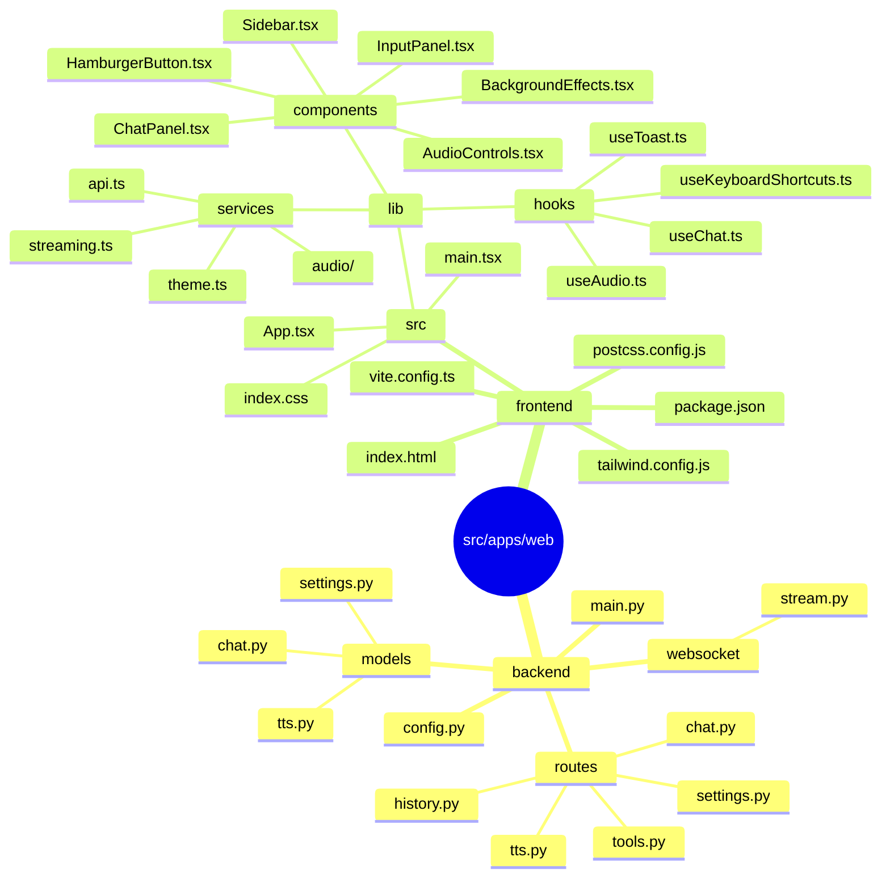
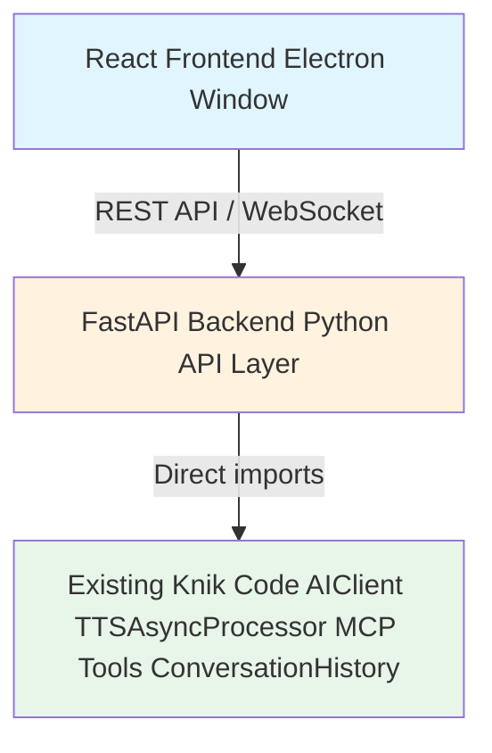

# Knik Web App

**Electron + React + Tailwind CSS + Python Backend**

## 📁 Folder Structure



## 🔗 Integration with Existing Code

### **Backend Uses Existing Python Logic:**

All existing Knik functionality is accessed via imports:

```python
# backend/routes/chat.py
from imports import AIClient, ConversationHistory
from lib.services.ai_client.registry import MCPServerRegistry
```

**No changes to:**

- `src/lib/` - Core logic, services, MCP tools
- `src/apps/console/` - Console app
- `imports.py` - Central import hub

### **Architecture:**



## 🚀 Development

### **Backend Development:**

```bash
cd src/apps/web/backend
pip install fastapi uvicorn websockets
uvicorn main:app --reload --port 8000
```

### **Frontend Development:**

```bash
cd src/apps/web/frontend
npm install
npm run dev
```

### **Full Stack:**

```bash
# From project root
npm run dev
```

## 📝 Next Steps

1. ✅ **Folder structure created**
2. ⏳ Setup frontend (React + Vite + Tailwind)
3. ⏳ Create FastAPI backend with existing logic
4. ⏳ Build React UI components
5. ⏳ Implement smooth CSS animations
6. ⏳ Connect frontend to backend
7. ⏳ Setup Electron wrapper
8. ⏳ Package and test

---

**Status:** Phase 1 - Todo 1 Complete ✅
