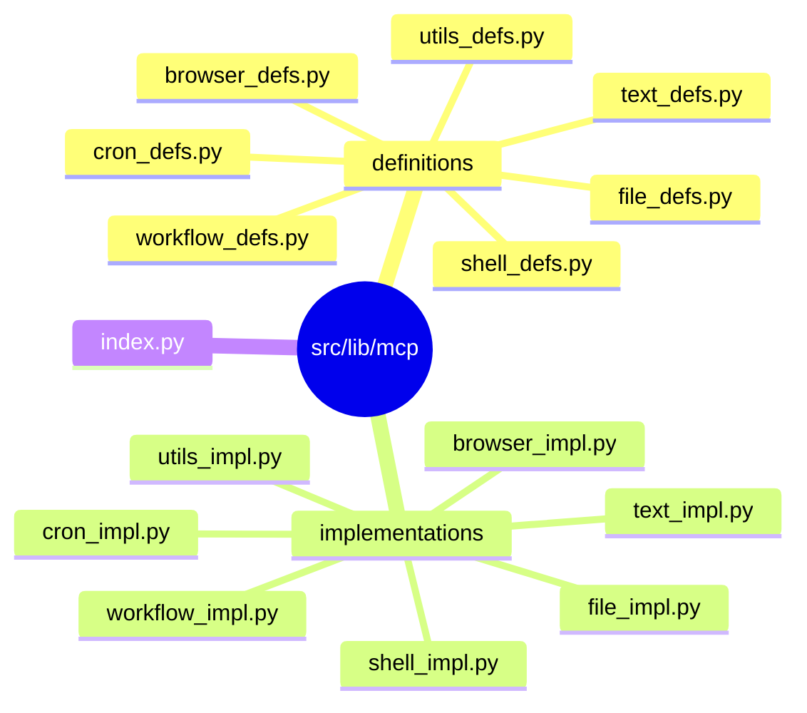

# MCP Tools System

Model Context Protocol (MCP) tools extend AI capabilities with executable functions.

## Architecture



Clean separation: definitions (JSON schemas) vs implementations (Python functions).

## Built-in Tools (31)

### Utility (4)

- `calculate` - Basic math expressions
- `get_current_time` - Current timestamp
- `get_current_date` - Today's date
- `reverse_string` - Reverse text

### Text Processing (5)

- `word_count` - Text statistics
- `find_and_replace` - Find/replace with case options
- `extract_emails` - Extract email addresses
- `extract_urls` - Extract URLs
- `text_case_convert` - Convert case (upper, lower, snake, camel, kebab)

### Shell (1)

- `run_shell_command` - Execute shell commands (safe, timeout protected)

### File System (8)

- `read_file` - Read the complete contents of a file or a specific line range
- `list_directory` - List all files and directories in a given path
- `search_in_files` - Search for a pattern (text or regex) across multiple files in a directory
- `file_info` - Get detailed information about a file or directory
- `write_file` - Write content to a file
- `append_to_file` - Append content to an existing file
- `find_in_file` - Search for a pattern within a specific file
- `count_in_file` - Count how many times a pattern appears in a file

### Browser (6)

- `browser_navigate` - Navigate to a URL
- `browser_get_text` - Extract text content from the current page
- `browser_get_links` - Get all links from the current page
- `browser_click` - Click an element on the page
- `browser_type` - Type text into an input field
- `browser_screenshot` - Take a screenshot of the current page

### Cron (3)

- `list_cron_schedules` - List all cron schedules
- `add_cron_schedule` - Add a new cron schedule
- `remove_cron_schedule` - Remove a cron schedule

### Workflow (4)

- `create_workflow` - Create a new workflow
- `remove_workflow` - Remove a workflow
- `list_workflows` - List all workflows
- `get_workflow_templates` - Get available workflow templates

## Usage

AI automatically uses tools when appropriate:

```text
You: What's 15 * 8 + 20?
AI: The result is 140.

You: Convert "HelloWorld" to snake_case
AI: Result: hello_world

You: /tools  # View all available tools
```

## Creating Custom Tools

### Step 1: Create Definition

Create `src/lib/mcp/definitions/my_tools_defs.py`:

```python
MY_TOOLS_DEFINITIONS = [
    {
        "name": "tool_name",
        "description": "Clear description for AI about when to use this",
        "parameters": {
            "type": "object",
            "properties": {
                "param1": {
                    "type": "string",
                    "description": "What param1 is for"
                },
                "param2": {
                    "type": "integer",
                    "description": "What param2 is for",
                    "default": 10
                }
            },
            "required": ["param1"]
        }
    }
]
```

### Step 2: Create Implementation

Create `src/lib/mcp/implementations/my_tools_impl.py`:

```python
def tool_name(param1: str, param2: int = 10) -> str:
    result = f"{param1} processed with {param2}"
    return result

MY_TOOLS_IMPLEMENTATIONS = {
    "tool_name": tool_name,
}
```

### Step 3: Register

Update `definitions/__init__.py`:

```python
from .my_tools_defs import MY_TOOLS_DEFINITIONS

ALL_DEFINITIONS = (
    UTILS_DEFINITIONS + TEXT_DEFINITIONS + SHELL_DEFINITIONS
    + FILE_DEFINITIONS + CRON_DEFINITIONS + BROWSER_DEFINITIONS
    + WORKFLOW_DEFINITIONS + MY_TOOLS_DEFINITIONS
)
```

Update `implementations/__init__.py`:

```python
from .my_tools_impl import MY_TOOLS_IMPLEMENTATIONS

ALL_IMPLEMENTATIONS = {
    **UTILS_IMPLEMENTATIONS,
    **TEXT_IMPLEMENTATIONS,
    **SHELL_IMPLEMENTATIONS,
    **FILE_IMPLEMENTATIONS,
    **CRON_IMPLEMENTATIONS,
    **BROWSER_IMPLEMENTATIONS,
    **WORKFLOW_IMPLEMENTATIONS,
    **MY_TOOLS_IMPLEMENTATIONS,
}
```

Tools auto-register on startup.

## Tool Schema Reference

### Parameter Types

- `string` - Text input
- `integer` - Whole numbers
- `number` - Integers or floats
- `boolean` - true/false
- `array` - Lists
- `object` - Nested objects

### Required Fields

**Tool Definition:**

- `name` - Unique identifier
- `description` - When/how AI should use it
- `parameters` - JSON Schema object

**Parameters:**

- `type` - Must be "object"
- `properties` - Parameter definitions
- `required` - Array of required param names (optional)

### Best Practices

1. **Clear descriptions** - Help AI understand when to use the tool
2. **Type hints** - Use Python type hints in implementations
3. **Error handling** - Return error messages as strings
4. **Keep focused** - One tool = one purpose
5. **Test edge cases** - Handle invalid inputs gracefully

## Debugging

**Check registration:**

```
You: /tools
```

**Enable logs:**

```bash
export KNIK_SHOW_LOGS=true
```

**Test manually:**

```python
from lib.mcp.implementations.utils_impl import calculate

result = calculate("2 + 2")
print(result)  # "4"
```

## Security

- Tools run with application permissions
- Sanitize file paths
- Validate inputs
- Don't expose sensitive data
- Consider rate limiting for expensive operations

## Performance

- Keep tools fast (< 1 second)
- Use async for long operations
- Cache results when appropriate
- Stream large outputs
- Set reasonable defaults

## See Also

- [Console Guide](console.md) - Using MCP tools in console
- [API Reference](../reference/api.md) - AIClient and tool registration API
- [Scheduler Guide](scheduler.md) - Using MCP tools in workflow nodes
