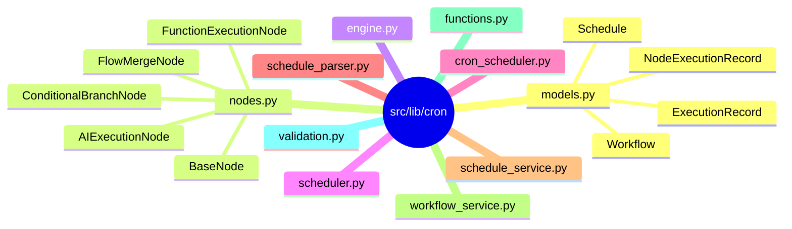
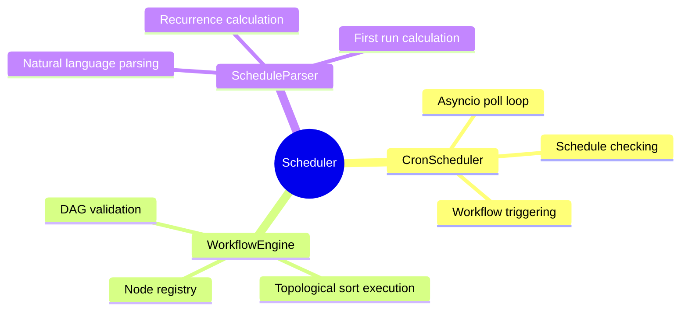
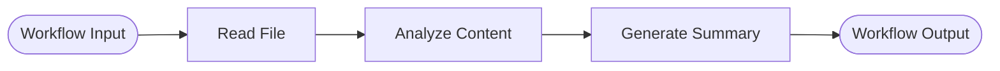
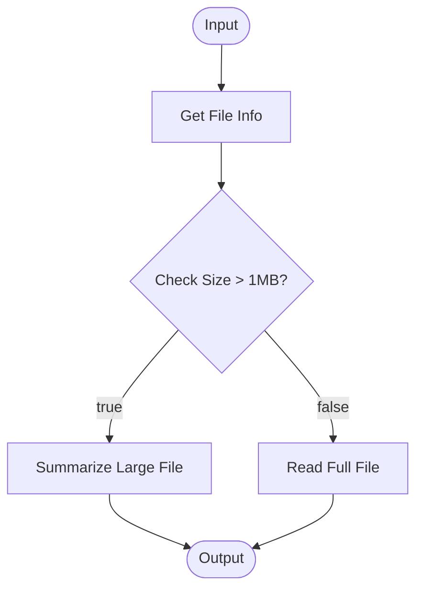
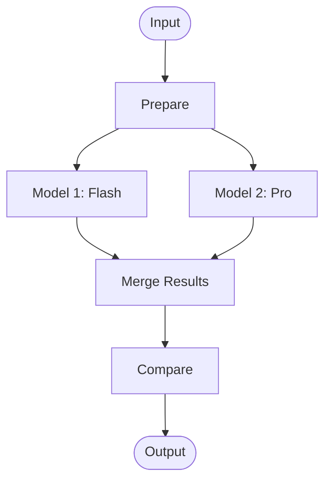

# Workflow Scheduler System

## Overview

Knik's Workflow Scheduler is a poll-based system with node-based workflow execution. It supports directed acyclic graph (DAG) workflows with AI execution nodes, function execution nodes, conditional branching, and flow merging capabilities.

**Key Features:**

- **Natural language scheduling** - Describe schedules in plain English (e.g., "every 5 minutes", "daily at 9am")
- **Node-based workflows** - Modular execution units connected as directed graphs
- **AI integration** - Execute AI queries as workflow nodes with full AIClient capabilities
- **Function execution** - Run MCP tools or custom Python functions as workflow nodes
- **Conditional branching** - Dynamic flow routing based on node results
- **Flow merging** - Combine results from parallel execution branches
- **Async execution** - Non-blocking workflow processing with background asyncio tasks
- **Execution history** - Track workflow runs with detailed node-level traces
- **PostgreSQL persistence** - All data stored in PostgreSQL for reliability

## Architecture

### Three-Layer Structure



### Component Hierarchy



## Scheduling (Natural Language)

Schedules are created using **natural language descriptions**, not cron expressions. The parser converts descriptions into a `next_run_at` datetime and a `recurrence_seconds` interval.

### Supported Formats

```text
every 5 minutes          -> recurrence: 300s
every 2 hours            -> recurrence: 7200s
every 3 days             -> recurrence: 259200s
every 2 weeks            -> recurrence: 1209600s
hourly                   -> recurrence: 3600s
daily                    -> recurrence: 86400s
weekly                   -> recurrence: 604800s
daily at 9am             -> recurrence: 86400s, first run at next 9:00 AM
every Monday at 2pm      -> recurrence: 604800s, first run at next Monday 2:00 PM
```

The parser uses regex matching for common patterns and falls back to the `dateparser` library for more complex expressions like "tomorrow at 3pm" or "in 5 minutes".

### Schedule Model

```python
@dataclass
class Schedule:
    id: int
    target_workflow_id: str        # References a Workflow.id
    enabled: bool = True
    timezone: str = "UTC"
    schedule_description: str | None = None  # Natural language description
    next_run_at: datetime          # Computed next execution time
    recurrence_seconds: int        # Interval in seconds
    created_at: datetime
    updated_at: datetime
    last_executed_at: datetime
```

### Creating a Schedule (via API)

```bash
# POST /api/cron/
curl -X POST http://localhost:8000/api/cron/ \
  -H "Content-Type: application/json" \
  -d '{
    "target_workflow_id": "daily_summary",
    "schedule_description": "every day at 9am",
    "timezone": "America/New_York"
  }'
```

## Node Types

### BaseNode (Abstract)

```python
class BaseNode(ABC):
    node_id: str

    async def execute(self, inputs: dict[str, Any]) -> dict[str, Any]:
        """Execute node logic. Return dict with results."""

    def validate(self) -> bool:
        """Validate node configuration."""

    def get_info(self) -> dict[str, Any]:
        """Get node metadata."""
```

### AIExecutionNode

Executes AI queries using `AIClient.chat()`. Automatically receives context from predecessor nodes as structured XML.

```python
AIExecutionNode(
    node_id="analyze",
    prompt="Summarize this data: {input.data}",
    model="gemini-1.5-flash",       # Default
    provider="vertex",              # Default
    temperature=0.7,                # Default
    use_tools=True                  # Default — enables MCP tool access
)
```

Template variables like `{input.data}` or `{node_id.output}` are resolved from predecessor outputs.

### FunctionExecutionNode

Executes registered Python functions or MCP tools. Can also run raw Python code via `exec()`.

```python
# Using a registered function
FunctionExecutionNode(
    node_id="read_logs",
    function_name="read_file",
    params={"file_path": "/var/log/app.log"}
)

# Using inline Python code
FunctionExecutionNode(
    node_id="transform",
    function_name="custom",
    code="output = len(inputs.get('data', ''))"
)
```

### ConditionalBranchNode

Evaluates a boolean expression and routes execution to different paths. Downstream edges use `condition` labels (`"true"` / `"false"`) to determine which path to follow.

```python
ConditionalBranchNode(
    node_id="check_size",
    condition="{check.output.size} > 1000000"    # Template vars resolved from inputs
)
```

### FlowMergeNode

Merges outputs from multiple parallel branches into a single output.

```python
FlowMergeNode(
    node_id="merge",
    merge_strategy="concat"    # Default: flattens all inputs into one dict
)
```

## Workflow Model

```python
@dataclass
class Workflow:
    id: str
    name: str
    definition: dict[str, Any]     # Full workflow structure (nodes + connections)
    description: str | None
    created_at: datetime
    updated_at: datetime
    last_executed_at: datetime
```

The `definition` dict contains the nodes and their connections, which the `WorkflowEngine` parses into a DAG for execution.

## Execution Pipeline

### Poll-Based Scheduling

1. `CronScheduler.start()` creates an asyncio task running `_poll_loop()`
2. The poll loop checks all schedules at a configurable interval (`KNIK_SCHEDULER_CHECK_INTERVAL`, default: 60s)
3. For each enabled schedule where `next_run_at <= now`:
   - Triggers `_trigger_workflow(workflow_id)` as a detached asyncio task
   - Bumps `next_run_at = now + timedelta(seconds=recurrence_seconds)`
   - Records the execution timestamp

### DAG Execution (WorkflowEngine)

1. Validates the workflow definition
2. Parses nodes and connections into an adjacency list with in-degree map
3. Executes via **topological BFS**: starts with zero-in-degree nodes, passes predecessor outputs as input context
4. `ConditionalBranchNode` only follows edges whose `condition` label matches the boolean result
5. Every node execution is logged individually (`NodeExecutionRecord`)
6. The overall execution is logged as an `ExecutionRecord` with status, duration, and outputs

## Node Flow Diagrams

### Simple Linear Workflow



### Conditional Branching



### Parallel Execution with Merge



## Web API

### Workflow Endpoints (`/api/workflows`)

| Method | Path                                         | Description                |
| ------ | -------------------------------------------- | -------------------------- |
| GET    | `/api/workflows/`                            | List all workflows         |
| GET    | `/api/workflows/{id}`                        | Get a specific workflow    |
| DELETE | `/api/workflows/{id}`                        | Delete a workflow          |
| POST   | `/api/workflows/{id}/execute`                | Execute a workflow         |
| GET    | `/api/workflows/{id}/history`                | Get execution history      |
| GET    | `/api/workflows/{id}/executions/{eid}/nodes` | Get node execution details |

### Schedule Endpoints (`/api/cron`)

| Method | Path                    | Description                      |
| ------ | ----------------------- | -------------------------------- |
| GET    | `/api/cron/`            | List all schedules               |
| POST   | `/api/cron/`            | Add a new schedule               |
| DELETE | `/api/cron/{id}`        | Remove a schedule                |
| PATCH  | `/api/cron/{id}/toggle` | Toggle schedule enabled/disabled |

### Analytics Endpoints (`/api/analytics`)

| Method | Path                            | Description                      |
| ------ | ------------------------------- | -------------------------------- |
| GET    | `/api/analytics/dashboard`      | Dashboard summary                |
| GET    | `/api/analytics/metrics`        | System metrics                   |
| GET    | `/api/analytics/top-workflows`  | Top workflows by execution count |
| GET    | `/api/analytics/executions`     | Paginated execution records      |
| GET    | `/api/analytics/workflows/list` | Workflows list for analytics     |
| GET    | `/api/analytics/activity`       | Activity timeline                |

## Persistence (PostgreSQL)

All scheduler data is stored in PostgreSQL. The four core tables:

- **workflows** - Workflow definitions (id, name, description, definition JSONB)
- **schedules** - Schedule configurations (target_workflow_id, schedule_description, next_run_at, recurrence_seconds)
- **executions** - Execution history (workflow_id, status, inputs/outputs JSONB, duration_ms)
- **node_executions** - Node-level execution traces (execution_id, node_id, node_type, status, inputs/outputs JSONB)

## Configuration

### Environment Variables

```bash
KNIK_SCHEDULER_CHECK_INTERVAL=60    # Seconds between poll checks
KNIK_SCHEDULER_WORKERS=4            # Worker pool size
KNIK_SCHEDULER_MAX_CONCURRENT=10    # Max concurrent workflows

KNIK_DB_HOST=localhost
KNIK_DB_PORT=5432
KNIK_DB_USER=postgres
KNIK_DB_PASS=password
KNIK_DB_NAME=knik
```

## MCP Tools for Scheduling

The AI can manage schedules and workflows through these MCP tools:

- `list_cron_schedules` - List all cron schedules
- `add_cron_schedule` - Add a new cron schedule
- `remove_cron_schedule` - Remove a cron schedule
- `create_workflow` - Create a new workflow
- `remove_workflow` - Remove a workflow
- `list_workflows` - List all workflows
- `get_workflow_templates` - Get available workflow templates

## Frontend Integration

The web frontend provides a visual interface for workflow management:

- **Workflows page** (`lib/pages/Workflows.tsx`) - List and manage workflows
- **Workflow Builder** (`lib/pages/WorkflowBuilder.tsx`) - Visual node graph editor with canvas, controls, and properties panels
- **Execution Detail** (`lib/pages/ExecutionDetail.tsx`) - View execution results and node traces
- **All Executions** (`lib/pages/AllExecutions.tsx`) - Browse all execution history
- **Schedule Manager** (`lib/sections/workflows/ScheduleManager/`) - Create and manage schedules with natural language input

## Best Practices

1. **Keep workflows simple** - Break complex workflows into smaller, reusable units
2. **Use meaningful node IDs** - Helps debugging and template variable resolution
3. **Handle errors gracefully** - Design workflows with error paths
4. **Test workflows manually** - Execute via API before scheduling
5. **Monitor execution history** - Check for patterns in failures
6. **Use appropriate models** - Flash for speed, Pro for complex tasks
7. **Set timeouts** - Prevent workflows from running indefinitely

## Related Documentation

- [MCP Tools](mcp.md) - MCP tools used in FunctionExecutionNode
- [Console Guide](console.md) - Console app `/workflow` command
- [Web App Guide](web-app.md) - Web app integration
- [API Reference](../reference/api.md) - Core API reference
- [Environment Variables](../reference/environment-variables.md) - Scheduler configuration
