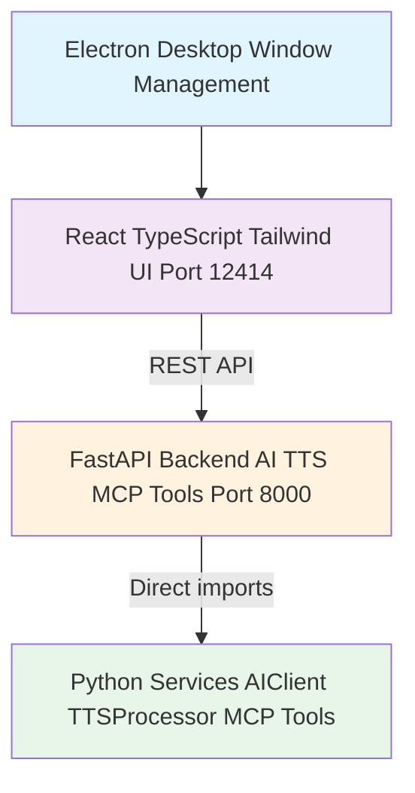

# Knik Web App

Modern web interface with React + FastAPI for AI chat, workflow management, and scheduling.

## Architecture

### Three-Layer Stack



## Frontend (React)

### Tech Stack

- **React 18** - UI framework
- **TypeScript** - Type safety
- **Vite** - Build tool with lightning-fast HMR
- **Tailwind CSS** - Utility-first styling

### Project Structure

```
src/apps/web/frontend/src/
  App.tsx                  # Main layout orchestrator
  main.tsx                 # Entry point
  lib/
    pages/                 # Route-level pages
      Home.tsx
      Workflows.tsx
      WorkflowBuilder.tsx
      ExecutionDetail.tsx
      AllExecutions.tsx
    sections/              # Domain-specific UI sections
      audio/               # AudioControls
      chat/                # ChatPanel, InputPanel
      effects/             # BackgroundEffects
      feedback/            # ErrorBoundary, Toast
      home/                # KeyboardShortcuts, SuggestionCards, WelcomeContainer, WelcomePrompt
      layout/              # MainLayout, Sidebar, TopBar
      theme/               # ThemeProvider, ThemeSelector, ThemeToggle
      workflows/           # WorkflowHub, WorkflowsTable, ExecutionHistory, ScheduleManager, WorkflowBuilder
    components/            # 30+ reusable UI components
      ActionButton, Card, Modal, Table, Pagination, SearchBar,
      StatusBadge, MetricCard, MarkdownMessage, ExecutionFlowGraph, etc.
    services/              # API client, streaming, theme, audio
    hooks/                 # useAudio, useChat, useKeyboardShortcuts, useToast
    types/                 # TypeScript type definitions
```

### Key Sections

**Chat** (`lib/sections/chat/`)
- ChatPanel: Scrollable message display with glassmorphic effects and animated bubbles
- InputPanel: Text input with Enter key support, Send button, voice toggle

**Workflows** (`lib/sections/workflows/`)
- WorkflowHub: Workflow dashboard
- WorkflowsTable: Workflow listing
- WorkflowBuilder/: Visual node graph editor with Canvas, FloatingControls, NodePropertiesPanel, WorkflowNavbar
- ScheduleManager/: Create and manage schedules with ScheduleCard, ScheduleForm, ScheduleList
- ExecutionHistory/: HistoryTable, ExecutionDetail

**Layout** (`lib/sections/layout/`)
- MainLayout: Page wrapper
- TopBar: Navigation and actions
- Sidebar: History integration with backend API

### Services

**API Client** (`lib/services/api.ts`)

```typescript
const API_BASE_URL = 'http://localhost:8000/api'

await api.chat(message)          // Text + audio response
await api.getHistory()           // Conversation history
await api.clearHistory()         // Clear history
await api.getSettings()          // Current settings
```

**Audio Service** (`lib/services/audio/`)

```typescript
queueAudio(base64Audio, sampleRate)  // Queue WAV chunk for playback
pauseAudio() / resumeAudio() / stopAudio()
```

### Animations

All animations use GPU-accelerated properties (transform, opacity) for 60fps:
- `gradient-shift` (8s ease infinite)
- `slide-in-right` / `slide-in-left` (300ms bounce)
- `fade-in` (500ms ease-out)

## Backend (FastAPI)

### API Endpoints (22 total)

**Base URL:** `http://localhost:8000`

| Route File | Prefix | Endpoints |
| --- | --- | --- |
| `chat.py` | `/api/chat` | POST `/` |
| `chat_stream.py` | `/api/chat/stream` | POST `/` |
| `admin.py` | `/api/admin` | GET/POST `/settings`, GET `/providers`, `/models`, `/voices` |
| `history.py` | `/api/history` | GET `/`, POST `/add`, POST `/clear` |
| `workflow.py` | `/api/workflows` | GET `/`, GET/DELETE `/{id}`, POST `/{id}/execute`, GET `/{id}/history`, GET `/{id}/executions/{eid}/nodes` |
| `cron.py` | `/api/cron` | GET `/`, POST `/`, DELETE `/{id}`, PATCH `/{id}/toggle` |
| `analytics.py` | `/api/analytics` | GET `/dashboard`, `/metrics`, `/top-workflows`, `/executions`, `/workflows/list`, `/activity` |

See [API Reference](../reference/api.md) for detailed endpoint documentation.

### Backend Structure

```
src/apps/web/backend/
  main.py           # FastAPI app entry point with CORS, lifespan handlers
  config.py         # WebBackendConfig (reads from .env)
  routes/
    chat.py         # Chat endpoint (text + audio response)
    chat_stream.py  # SSE streaming chat endpoint
    admin.py        # Settings and provider management
    history.py      # Conversation history CRUD
    workflow.py     # Workflow CRUD and execution
    cron.py         # Schedule management (natural language)
    analytics.py    # Dashboard, metrics, activity
```

### Configuration

Backend reads from environment variables (via `WebBackendConfig`):

```bash
KNIK_AI_PROVIDER=vertex          # AI provider
KNIK_AI_MODEL=gemini-2.5-flash   # Model name
GOOGLE_CLOUD_PROJECT=your-project # GCP project ID
KNIK_AI_LOCATION=us-central1     # Vertex AI region
KNIK_TEMPERATURE=0.7             # AI temperature
KNIK_MAX_TOKENS=25565            # Max output tokens
KNIK_VOICE=af_heart              # Voice name
KNIK_LANGUAGE=a                  # Language code
KNIK_WEB_HOST=0.0.0.0           # Server host
KNIK_WEB_PORT=8000              # Server port
KNIK_WEB_RELOAD=true            # Auto-reload
KNIK_HISTORY_CONTEXT_SIZE=5     # Context messages for AI
```

See [Environment Variables](../reference/environment-variables.md) for all options.

## Development

### Starting the App

```bash
# Start backend and frontend separately (two terminals)
npm run start:web:backend    # Backend on :8000
npm run start:web:frontend   # Frontend on :12414

# Or use shell scripts
./scripts/start_web_backend.sh
./scripts/start_web_frontend.sh
```

There is no combined `npm run start:web` script — you must start backend and frontend separately.

### Hot Reload

- **Backend:** Uvicorn auto-reload watches `src/` directory
- **Frontend:** Vite HMR updates instantly on file save

### Electron Desktop App

The web app can be wrapped in Electron for desktop distribution:

```bash
npm run start:electron    # Development mode
npm run electron:dev      # Runs backend + frontend + electron concurrently
npm run electron:build    # Build for current platform
```

See [Electron Guide](electron.md) for details.

## Troubleshooting

### Backend Won't Start

```bash
cat .env                  # Check if .env file exists
which python              # Should show .venv/bin/python
lsof -i :8000            # Check if port is available
```

### Frontend Build Issues

```bash
cd src/apps/web/frontend
rm -rf node_modules package-lock.json
npm install
```

### CORS Errors

Backend allows `http://localhost:12414` by default. If using a different port, update `main.py`:
```python
allow_origins=["http://localhost:YOUR_PORT"]
```

## Related Documentation

- [MCP Tools](mcp.md) - AI-callable tools system
- [Console App](console.md) - Terminal-based interface
- [GUI App](gui.md) - CustomTkinter desktop app
- [Scheduler](scheduler.md) - Workflow scheduling system
- [API Reference](../reference/api.md) - Detailed API docs
- [Environment Variables](../reference/environment-variables.md) - Configuration guide
