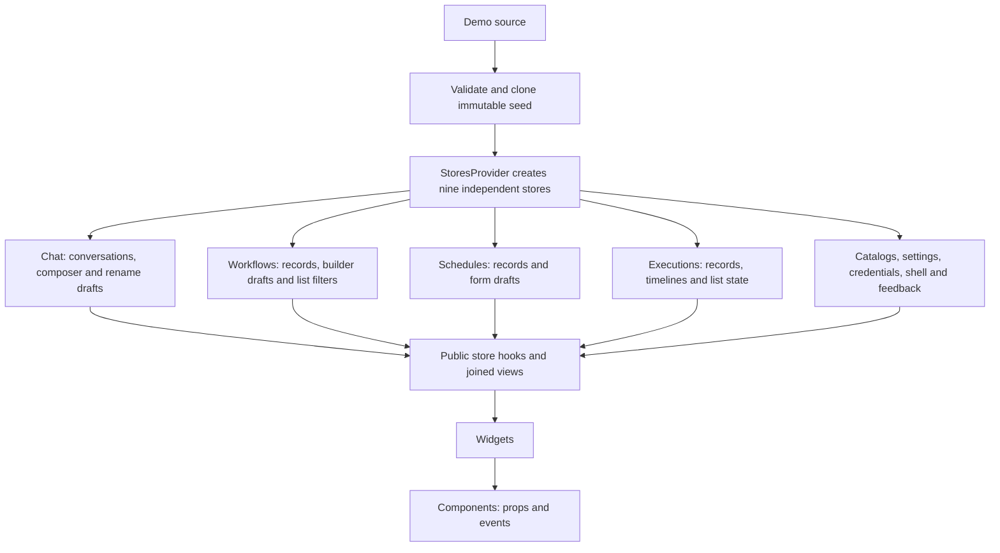
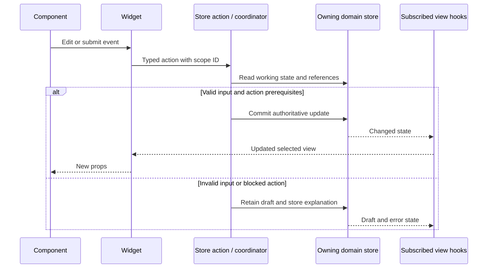
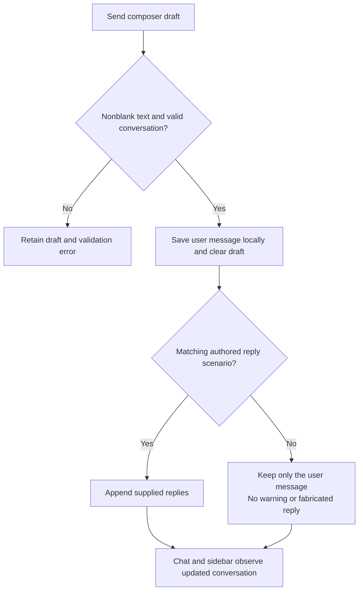

# Frontend domain stores and component consolidation

The approved design moves all application state into independent Zustand stores under `src/apps/web/frontend/src/lib/stores`. Widgets consume store hooks and actions; components receive props and emit events. This supersedes the earlier widget-owned session design. Backend code and application API integration remain outside this change.

## Approved compact workspace redesign (2026-10-09)

Use a fixed visual system with light/dark mode. Remove accent, density and radius preferences from settings, contracts and normalized appearance state. Keep all records, routes, demo response selection, save/cancel behavior and store ownership unchanged. Any nonblank chat message still sends locally regardless of reply availability.

| Foundation     | Dark      | Light     |
| -------------- | --------- | --------- |
| Background     | `#18191B` | `#F7F8F8` |
| Surface        | `#202225` | `#FFFFFF` |
| Primary text   | `#F1F2F3` | `#1C2024` |
| Secondary text | `#A5ABB3` | `#59636E` |
| Divider        | `#363A40` | `#DCE1E5` |
| Accent         | `#55B8AC` | `#147D73` |

Inter remains the interface font and JetBrains Mono the code font. Page titles are 24px, section titles 16px, interface text 14px and chat text 16px. Use solid surfaces, a 4px spacing scale, 36px desktop controls, 44px touch targets, 6px control corners, 10px panels and a 12px composer. Remove ambient glow, glass, decorative gradients and repeated entrance motion. Preserve a visible focus indicator and reduced-motion support.

| Screen           | Target layout                                                                                                 |
| ---------------- | ------------------------------------------------------------------------------------------------------------- |
| Shell            | 232px sidebar, 64px rail, 52px header; one primary route scroller                                             |
| Chat             | 800px transcript/composer, compact suggestions, model and Tools beside input; right tools drawer              |
| Workflow library | Compact heading, inline metrics, filters and canonical table                                                  |
| Builder          | Flexible canvas; selected-only 320px right inspector; drawer below 1024px                                     |
| Execution detail | Compact metadata, flexible graph, 280px collapsible Inputs/Outputs/Timeline panel; Outputs initially selected |
| Schedules        | Canonical table with existing toggle/delete actions                                                           |
| Settings         | 176px category navigation, content up to 760px, flat titled sections and aligned rows                         |

At 768–1023px navigation uses a rail without changing the desktop preference. Below 768px navigation uses a left drawer, settings tabs become horizontal with matching arrow-key behavior, and execution panels stack. Tables and code scroll within their own containers. Drawers use the available phone width.

Implementation order: unify tokens and mode-only appearance; restyle shared controls and extend Modal placement; migrate shell/chat/settings; migrate workflow screens; remove unused styles, effects and exports. New UI state remains in existing store scopes. Components receive props/events; no parallel controls, new UI framework, backend requests or persistence are introduced.

Verification covers keyboard and focus behavior, Enter/Shift+Enter/IME, draft retention while opening tools, cross-widget tool updates, stable table actions, route scope disposal, seed resets, and all routes at 1440/1024/768/390px in both themes. Run frontend format, lint, type check, tests, build and browser checks; retain transport/storage/media guards. Historical architecture diagrams below are not visual mockups of this redesign.

## Architecture diagrams

Start with [domain ownership](../../.archify/store-architecture/domain-stores/domain-stores.html), then follow the data and interaction views. Each linked HTML file is standalone, static by default, and includes its own dark/light viewer.

| View                                                                                         | The question it answers                                                    | Validation receipt                                                                                       |
| -------------------------------------------------------------------------------------------- | -------------------------------------------------------------------------- | -------------------------------------------------------------------------------------------------------- |
| [Architecture](../../.archify/store-architecture/domain-stores/domain-stores.html)           | Which store owns my ongoing chat, workflow draft, settings, or list state? | [Receipt](../../.archify/store-architecture/domain-stores/review-3/domain-stores.finalize-summary.json)  |
| [Data flow](../../.archify/store-architecture/store-dataflow/store-dataflow.html)            | How do demo records become store data and component props?                 | [Receipt](../../.archify/store-architecture/store-dataflow/store-dataflow.finalize-summary.json)         |
| [Interactions](../../.archify/store-architecture/store-interactions/store-interactions.html) | What happens on edit, Save, Send, Run, Cancel, and navigation?             | [Receipt](../../.archify/store-architecture/store-interactions/store-interactions.finalize-summary.json) |
| [Session lifecycle](../../.archify/store-architecture/store-lifecycle/store-lifecycle.html)  | What survives leaving a page, returning, and reloading?                    | [Receipt](../../.archify/store-architecture/store-lifecycle/store-lifecycle.finalize-summary.json)       |
| [Migration](../../.archify/store-architecture/store-migration/store-migration.html)          | In what order do state ownership and consumers change?                     | [Receipt](../../.archify/store-architecture/store-migration/store-migration.finalize-summary.json)       |

These diagrams are labeled **proposed** because they specify the approved target behavior. Diagram validation verifies the specification and rendered artifacts; application verification is a separate gate. The [artifact index](../../.archify/store-architecture/README.md) records provenance and reproduction details. Generated outputs live under `.archify/store-architecture/`; timestamped authoring originals also remain under `.archify/`. This directory is ignored by Git, so diagram links are local to this checkout.

The Archify artifacts preserve the earlier proposed design and have not been regenerated for the 2026-10-09 chat clarification. The current Send contract is the chat flow below: save valid user messages independently of reply availability.

## Where each activity lives



| Domain        | Authoritative state                                                                            | Relationship                                                              |
| ------------- | ---------------------------------------------------------------------------------------------- | ------------------------------------------------------------------------- |
| `catalogs`    | Provider, model, voice and tool definitions                                                    | Models explicitly reference provider IDs                                  |
| `chat`        | Conversations, messages, active conversation, reply scenarios and scoped composer/rename state | Chat and sidebar read the same conversation records                       |
| `workflows`   | Saved definitions, builder drafts, selected node, validation and hub filters                   | One workflow owner serves the list and builder                            |
| `schedules`   | Schedule records and scoped creation/deletion state                                            | References canonical workflow IDs                                         |
| `executions`  | Execution records, timelines, run scenarios, filters, sorting and pagination                   | References canonical workflow IDs; execution and timeline commit together |
| `settings`    | Profile, preferences, appearance, enabled tool IDs and scoped settings state                   | References catalog IDs                                                    |
| `credentials` | Key metadata, supplied scenarios and create/delete/reveal state                                | No generated secrets                                                      |
| `shell`       | Sidebar and command palette state                                                              | Shared layout state                                                       |
| `feedback`    | Toast queue                                                                                    | Shared feedback state                                                     |

`views/` combines domains through selectors, deriving workflow metrics, joined rows, available models and recent conversations without storing duplicate records. React Router owns URLs; route IDs are inputs to store selectors.

## Data, commands and lifetime



Chat separates saving a message from replaying a reply:



- `StoresProvider` loads bundled demo data when its source is omitted. An explicit `DemoSource` replaces the default, including an explicitly empty source. Initialization completes before consumers mount.
- Normalize and validate IDs, catalog relationships, workflow graphs and scenario references. Clone source records so mutations cannot affect fixtures or another provider. Provider rerenders and route changes do not reseed.
- Store factories never import peer domains. `session/commands.ts` receives the bundle, validates cross-domain references, then dispatches an authoritative write to its owning store. Feedback follows the write; no subscriptions copy records between stores.
- Each widget instance receives an isolated working scope tied to its resource ID. Drafts, filters, sorting, selections, feature dialogs and validation errors live in the corresponding domain. Scope hooks support React StrictMode without writes during render.
- Save validates and commits. Invalid input retains the draft. Cancel resets or disposes that draft. Unmount/resource changes dispose affected working state. Committed records and appearance survive navigation; reload recreates the stores from the seed.
- Components keep only intrinsic UI behavior such as focus or control menus. Browser effects such as clipboard, downloads, audio handles and CSS variables remain in widgets, with their application inputs and status supplied by stores.
- Send saves any nonblank user message locally and clears its composer draft, regardless of model or demo scenario availability. Authored scenarios provide optional local replay: a matching scenario may append its supplied replies; otherwise the conversation retains only the user message with no warning or reply-unavailable status. Never fabricate an assistant message or make an API call. Whitespace-only input and a deleted target conversation retain the draft with a validation error.
- Run replays authored scenarios only. Edited workflow definitions must match the supplied run scenario. Missing run scenarios remain unavailable; previews require real audio assets and key creation requires a supplied sample-secret scenario.

## Implementation and acceptance

```text
lib/stores/
  session/       provider, bundle factory, coordinator, scope lifecycle
  demo/          canonical samples, normalization, validation
  catalogs/      read-only store.ts · selectors.ts · hooks.ts · index.ts
  chat/          store.ts · actions.ts · selectors.ts · hooks.ts · index.ts
  workflows/     same domain structure; list and builder share this owner
  schedules/     same domain structure
  executions/    same domain structure
  settings/      same domain structure
  credentials/   same domain structure
  shell/         same domain structure
  feedback/      same domain structure
  views/         cross-domain selectors and view hooks
```

Contracts belong under `src/types/stores`. App imports the provider through `$stores`; widgets use public domain and view barrels. Raw factories, APIs, `getState`/`setState`, fixtures and store contexts remain internal, with test-only access for focused verification.

1. Establish types, independent factories, bundled seed, provider, commands and scope lifecycle.
2. Migrate catalogs, settings, chat, shell and feedback; then workflows/builder, schedules and executions.
3. Control the builder graph through its workflow draft. Remove independent ReactFlow definition state and imperative canvas save reads. Populate model choices from the catalog store.
4. Remove the old widget session subsystem, local application state and obsolete demo imports. Preserve canonical controls and current routes.
5. Update aliases, barrels and architecture rules for aliases, relative imports, re-exports and dynamic imports. Publish these diagrams and update architecture documentation.
6. Run formatting checks, lint, TypeScript, Vitest, production build and browser tests.

Tests stay under `src/tests/`, with domain tests organized in `stores/<domain>`. Acceptance includes provider isolation, seed immutability, shared updates, simultaneous editors, save/invalid/Cancel, cleanup on unmount, navigation retention, reload reset, missing route IDs, valid references, stable subscriptions and dynamic catalogs across chat/settings/builder. Browser checks cover all routes, light/dark appearance and narrow layouts, with zero application API, stream, polling, browser-persistence or microphone requests. Static assets remain allowed.

Chat acceptance covers local sends without a model or matching scenario, cleared drafts after valid sends, optional authored replies only when matched, user-only messages without warnings or fabricated replies when unmatched, and retained drafts for whitespace-only input or deleted conversations. Saved user messages must update subscribed views without backend interaction.

## Verified baseline and implementation evidence

At baseline `df7069f8e6b1a735849a4bd7d4fecf74f8d3081b`, inspection established:

- `App.tsx` mounted `DemoSessionProvider` above the router.
- `widgets/session/DemoSessionProvider.tsx` created one Zustand store per provider lifetime.
- `widgets/session/seed.ts` cloned an explicitly supplied source and otherwise produced empty collections.
- `widgets/session/store.ts` combined conversations, workflows, schedules, executions, settings and feedback in one store.
- `widgets/workflows/WorkflowBuilderWidget.tsx` kept name/error state locally and read the canvas imperatively when saving.

Those are historical observations from committed bytes, not claims that the proposed domain-store design already existed at that revision. Final application verification should be recorded with the implementation result; prior consolidation test counts do not certify this migration.

### Implementation verification — 2026-10-08

At this checkpoint, the working tree implemented the independent stores, scoped drafts, controlled builder, canonical demo bootstrap and public widget hooks described above. The old widget session and duplicate demo modules had been removed. The catalog was read-only after bootstrap, so it had no mutation actions file. The following counts are dated evidence from before the 2026-10-09 chat clarification; they do not verify the revised Send contract.

- Vitest: **135 tests passed across 27 files**, including independent providers, source isolation, simultaneous drafts, StrictMode cleanup, model availability, relationship validation and re-export boundary enforcement.
- Browser: **11 Playwright checks passed**, covering all routes, missing IDs, chat replay, workflow/schedule changes, navigation and reload, light/dark themes, narrow layouts, and unavailable actions.
- Request guards observed no application API, streaming, persistence or microphone access. The browser harness narrowly recognizes the third-party `debug` package's startup access to its own debug keys; application storage remains forbidden.
- Frontend formatting, lint, TypeScript, production build and whitespace checks passed. Lint retains four pre-existing chart warnings and reports no errors.
- All five Archify artifacts passed showcase, delivery, provenance and browser gates; their published bytes match the reviewed hashes. These gates are separate from the application checks above.

Backend source is unchanged. Default voice previews remain unavailable without an audio asset, and key creation remains unavailable without a supplied sample-secret scenario. Authored chat and workflow results replay locally; no provider or execution service is invoked.
